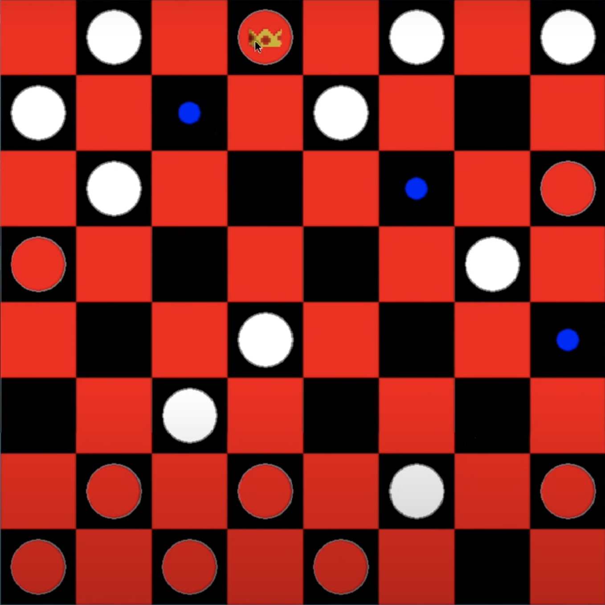

# Python-Checkers-AI (Checkers)

You will find hereunder the instructions and details of the checkers game.

The game is presented here with 2 AI techniques, search with the **Minimax Algorithm** and search with the **Monte Carlo Tree Search (MCTS) Algorithm**.

## Installation

In order to install the game, copy the repository with the git tool:

```
git clone https://github.com/jemappellesami/Python-Checkers-AI
```

Then, access the game:

```bash
cd Python-Checkers-AI
```

After having installed Python and Poetry, install the project dependancies:

```bash
poetry install
```

## Utilisation

You can then launch the game in the newly-created virtual environment.

When launching the game, you will need to choose which algorithms you will face or which will face each other, for instance:

```bash
poetry run python main.py --p1 minimax --p2 mcts
```

starts a game Minimax AI vs. MCTS AI.

It is possible to play against an AI by adapting the command as follows:

```bash
poetry run python main.py --p1 human --p2 mcts
```

You will then need to select which piece to move and where to place it during your turn.

The `--p1` et `--p2` options can take as argument minimax, mcts or human.

In summary:
```
usage: main.py [-h] --player1 {minimax,mcts,human} --player2 {minimax,mcts,human}

Checkers Game

optional arguments:
  -h, --help            show this help message and exit
  --player1 {minimax,mcts,human}, --p1 {minimax,mcts,human}, -1 {minimax,mcts,human}
                        Type of player for player 1
  --player2 {minimax,mcts,human}, --p2 {minimax,mcts,human}, -2 {minimax,mcts,human}
                        Type of player for player 2

```


